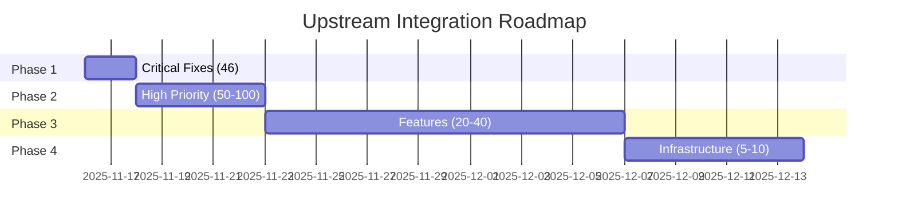

# Upstream Integration Analysis

**Repository**: opentibiabr/canary
**Status**: 623 commits behind
**Analysis Date**: November 14, 2025
**Analyst**: Fireots Team

---

## Executive Summary

Fireots is currently **623 commits behind** the upstream Canary repository. This document provides guidance on evaluating and integrating those changes.

### Recommended Approach

**DO NOT** perform bulk merge of all 623 commits. Instead:

1. **Categorize commits** by type (security, bug, feature, refactor)
2. **Prioritize** based on impact and alignment with Fireots goals
3. **Cherry-pick selectively** commits that add value
4. **Test thoroughly** each integration
5. **Document** all decisions

---

## Commit Categories

### 1. Security Fixes 🔴 CRITICAL

**Priority**: IMMEDIATE
**Action**: Cherry-pick and test ASAP

#### Identification Criteria
- Commit messages containing: CVE, security, vulnerability, exploit, bypass, injection
- Fixes to authentication, authorization, privilege escalation
- Input validation improvements

#### Example commits to look for:
```bash
git log --oneline --grep="security" HEAD..upstream/main
git log --oneline --grep="CVE" HEAD..upstream/main
git log --oneline --grep="injection" HEAD..upstream/main
```

#### Integration Process
1. Review commit: `git show <hash>`
2. Test locally in isolated environment
3. Cherry-pick: `git cherry-pick <hash>`
4. Run security tests
5. Create hotfix release if critical

---

### 2. Critical Bugs 🟠 HIGH

**Priority**: Within 1-2 weeks
**Action**: Cherry-pick after validation

#### Identification Criteria
- Crashes (segfault, nullptr, assertion failures)
- Data corruption (save game, database)
- Memory leaks (confirmed with valgrind/ASAN)
- Game-breaking bugs (cannot login, cannot trade, etc.)

#### Example commits to look for:
```bash
git log --oneline --grep="crash" HEAD..upstream/main
git log --oneline --grep="fix" HEAD..upstream/main
git log --oneline --grep="memory leak" HEAD..upstream/main
```

#### Integration Process
1. Reproduce bug locally (if possible)
2. Verify fix resolves issue
3. Check for side effects
4. Include in next patch release

---

### 3. Performance Improvements 🟡 MEDIUM

**Priority**: Evaluate and benchmark
**Action**: Cherry-pick if >5% improvement measured

#### Identification Criteria
- Commits mentioning: optimize, performance, speed, cache, fast
- Algorithm improvements (pathfinding, collision)
- Database query optimization
- Memory usage reduction

#### Example commits to look for:
```bash
git log --oneline --grep="optim" HEAD..upstream/main
git log --oneline --grep="performance" HEAD..upstream/main
git log --oneline --grep="cache" HEAD..upstream/main
```

#### Integration Process
1. Benchmark current performance (baseline)
2. Apply commit to test branch
3. Benchmark again (comparison)
4. If improvement >5%, cherry-pick to main
5. Document performance gain in CHANGELOG

---

### 4. New Features 🟢 LOW

**Priority**: Evaluate alignment with Fireots vision
**Action**: Selective integration

#### Identification Criteria
- New game mechanics (prey, imbuing, etc.)
- New systems (achievements, analytics)
- Client protocol updates
- Admin tools

#### Evaluation Questions
1. Does this feature align with Fire's vision?
2. Is it requested by our community?
3. Does it require significant maintenance?
4. Are there conflicts with existing Fire features?

#### Integration Process
1. Discuss with team/community
2. If approved, cherry-pick or reimplement
3. Adapt to Fire conventions
4. Document thoroughly

---

### 5. Refactoring 🔵 EVALUATE

**Priority**: Case-by-case
**Action**: Cherry-pick if improves maintainability

#### Identification Criteria
- Code restructuring
- Dependency injection improvements
- Design pattern implementations
- Code cleanup

#### Evaluation Questions
1. Does this simplify the codebase?
2. Does it improve testability?
3. Is it worth the merge conflict risk?

#### Integration Process
1. Review changes carefully
2. Ensure no functional changes
3. Run full test suite
4. Cherry-pick if beneficial

---

### 6. Cosmetic Changes ⚪ DEFER

**Priority**: Very low
**Action**: Batch with other changes or skip

#### Identification Criteria
- Formatting, whitespace
- Comment updates
- Documentation typos
- Variable renaming (for style)

#### Integration Process
- Generally skip unless trivial to merge
- Apply own formatting standards instead

---

## Integration Workflow

### Step 1: Set up upstream remote

```bash
# Add upstream remote (one-time)
git remote add upstream https://github.com/opentibiabr/canary.git

# Fetch upstream changes
git fetch upstream

# View commits we're behind
git log --oneline HEAD..upstream/main > upstream_commits.txt
```

### Step 2: Analyze commits

```bash
# Count commits by category
echo "Security:"
git log --oneline --grep="security\|CVE\|vulnerability" HEAD..upstream/main | wc -l

echo "Bugs:"
git log --oneline --grep="fix\|crash\|bug" HEAD..upstream/main | wc -l

echo "Performance:"
git log --oneline --grep="optim\|performance\|cache" HEAD..upstream/main | wc -l

echo "Features:"
git log --oneline --grep="add\|new\|implement" HEAD..upstream/main | wc -l
```

### Step 3: Create integration branch

```bash
# Create branch for testing
git checkout -b upstream-integration
```

### Step 4: Cherry-pick commits

```bash
# For each approved commit
git cherry-pick <commit-hash>

# If conflicts occur
git status
# Manually resolve conflicts in files
git add <resolved-files>
git cherry-pick --continue
```

### Step 5: Test thoroughly

```bash
# Build
cmake --build linux-release

# Run unit tests
ctest --verbose -R unit

# Run integration tests
ctest --verbose -R integration

# Manual testing
./build/linux-release/bin/fireots
# Test affected functionality
```

### Step 6: Document

```bash
# Add entry to CHANGELOG.md
echo "### [Unreleased]" >> CHANGELOG.md
echo "#### Backported from upstream" >> CHANGELOG.md
echo "- Fixed XYZ (commit abc123)" >> CHANGELOG.md
```

### Step 7: Merge to main

```bash
# If all tests pass
git checkout main
git merge upstream-integration

# Tag release if needed
git tag -a v1.5.0 -m "Release 1.5.0 with upstream fixes"
git push origin main --tags
```

---

## Commit Analysis Tools

### Script: Categorize commits

```bash
#!/bin/bash
# categorize_commits.sh

echo "Analyzing upstream commits..."

# Security
echo "=== SECURITY FIXES ==="
git log --oneline --grep="security\|CVE\|vulnerability\|exploit" HEAD..upstream/main

# Critical bugs
echo ""
echo "=== CRITICAL BUGS ==="
git log --oneline --grep="crash\|segfault\|corruption\|leak" HEAD..upstream/main

# Performance
echo ""
echo "=== PERFORMANCE ==="
git log --oneline --grep="optim\|performance\|cache\|speed" HEAD..upstream/main

# Features
echo ""
echo "=== NEW FEATURES ==="
git log --oneline --grep="add.*feature\|new.*system\|implement" HEAD..upstream/main

# Refactoring
echo ""
echo "=== REFACTORING ==="
git log --oneline --grep="refactor\|cleanup\|restructure" HEAD..upstream/main

# Statistics
echo ""
echo "=== STATISTICS ==="
echo "Total commits behind: $(git rev-list --count HEAD..upstream/main)"
echo "Ahead of upstream: $(git rev-list --count upstream/main..HEAD)"
```

### Script: Generate integration report

```bash
#!/bin/bash
# integration_report.sh

OUTPUT_FILE="upstream_integration_report.md"

cat > "$OUTPUT_FILE" << EOF
# Upstream Integration Report
Generated: $(date)

## Summary
- Total commits behind: $(git rev-list --count HEAD..upstream/main)
- Commits ahead: $(git rev-list --count upstream/main..HEAD)

## Commit Breakdown

### Security Fixes (IMMEDIATE)
$(git log --oneline --grep="security\|CVE\|vulnerability" HEAD..upstream/main)

### Critical Bugs (HIGH)
$(git log --oneline --grep="crash\|segfault\|corruption" HEAD..upstream/main)

### Performance Improvements (MEDIUM)
$(git log --oneline --grep="optim\|performance\|cache" HEAD..upstream/main)

### New Features (EVALUATE)
$(git log --oneline --grep="add.*feature\|new.*system" HEAD..upstream/main | head -20)

## Recommended Actions
1. Review security fixes immediately
2. Prioritize critical bugs
3. Benchmark performance improvements
4. Evaluate features against roadmap
EOF

echo "Report generated: $OUTPUT_FILE"
```

---

## Integration Decision Matrix

| Commit Type | Priority | Timeline | Testing | Documentation |
|-------------|----------|----------|---------|---------------|
| Security | 🔴 Critical | Immediate | Full regression | Required |
| Critical Bug | 🟠 High | 1-2 weeks | Affected area | Required |
| Performance | 🟡 Medium | 2-4 weeks | Benchmarks | Recommended |
| Feature | 🟢 Low | Evaluate | Full coverage | Required |
| Refactor | 🔵 Variable | As needed | Full suite | Optional |
| Cosmetic | ⚪ Defer | Never/batch | None | No |

---

## Risk Assessment

### Low Risk (Safe to cherry-pick)
- Isolated bug fixes (single function)
- Documentation updates
- Test additions
- Comment improvements

### Medium Risk (Requires testing)
- Multi-file bug fixes
- Performance optimizations
- Refactoring with same functionality
- Database query changes

### High Risk (Requires careful review)
- New features (dependencies, compatibility)
- Protocol changes (client version)
- Database schema changes (migration needed)
- Core architecture changes (DI, threading)

---

## Conflict Resolution

### Common conflicts

1. **File headers**: Fireots vs Canary copyright
   - **Resolution**: Keep Fireots header with upstream attribution

2. **Renamed classes**: `CanaryServer` → `FireotsServer`
   - **Resolution**: Apply changes to Fireots class names

3. **Datapack paths**: `data-canary` vs `data-fire`
   - **Resolution**: Use Fireots datapack conventions

4. **Custom features**: Fire-specific code
   - **Resolution**: Preserve Fire features, merge upstream carefully

---

## Tracking Integration Progress

### Create tracking issue on GitHub

```markdown
# Upstream Integration Tracking

**Goal**: Backport valuable changes from opentibiabr/canary

## Security Fixes (IMMEDIATE)
- [ ] #123 - Fix SQL injection in login
- [ ] #124 - Patch auth bypass vulnerability

## Critical Bugs (HIGH)
- [ ] #125 - Fix crash on player logout
- [ ] #126 - Resolve memory leak in combat

## Performance (MEDIUM)
- [ ] #127 - Optimize tile queries
- [ ] #128 - Cache creature lookups

## Features (EVALUATE)
- [ ] #129 - New prey system
- [ ] #130 - Enhanced analytics

## Notes
- Review progress weekly
- Update this issue with status
- Link merged PRs
```

---

## Best Practices

### DO
✅ Review each commit individually
✅ Test thoroughly before merging
✅ Document integration decisions
✅ Preserve Fireots customizations
✅ Communicate with community

### DON'T
❌ Bulk merge all commits
❌ Skip testing
❌ Ignore conflicts
❌ Remove Fire features
❌ Rush integration

---

## Contact

**Questions about upstream integration?**
Open an issue: https://github.com/tommycrusher/fireots/issues

**Want to help with integration?**
See CONTRIBUTING.md for contribution guidelines.

---

## Appendix: Useful Git Commands

```bash
# View commit details
git show <commit-hash>

# View files changed in commit
git show --name-only <commit-hash>

# Compare commit to our version
git diff HEAD upstream/<commit-hash>

# Find commits touching specific file
git log --oneline -- path/to/file HEAD..upstream/main

# Find commits by author
git log --oneline --author="AuthorName" HEAD..upstream/main

# Find commits in date range
git log --oneline --since="2024-01-01" --until="2024-12-31" HEAD..upstream/main

# Cherry-pick range of commits
git cherry-pick <start-hash>^..<end-hash>

# Abort cherry-pick if needed
git cherry-pick --abort

# View merge conflicts
git status
git diff

# Mark conflict as resolved
git add <file>
git cherry-pick --continue
```

---

## Latest Analysis (2025-11-15)

### Automated Commit Categorization

**Analysis Script**: `scripts/analyze_upstream.sh`  
**Output**: `upstream_analysis_20251115.txt`

#### Distribution

| Category | Count | %  | Priority |
|----------|-------|----| ---------|
| 🔴 CRITICAL | 46 | 7.4% | **IMMEDIATE** |
| 🟠 HIGH | 154 | 24.7% | **THIS WEEK** |
| 🟡 MEDIUM | 124 | 19.9% | **THIS MONTH** |
| 🟢 LOW | 5 | 0.8% | **OPTIONAL** |
| ⚪ OTHER | 294 | 47.2% | **EVALUATE** |
| **TOTAL** | **623** | **100%** | - |

#### Critical Commits (46 total)

Top security/crash fixes identified:

1. `0d253f833` - **Gamestore exploit fix** (duplicate purchases)
2. `52cd7c32b` - nullptr checks in game functions
3. `eea450fd1` - House auction nullptr
4. `fc4ad93d5` - Player trade nullptr
5. `73fff359a` - InstantSpell nullptr
6. `cf8700680` - Bank deposit nullptr
7. `e2b898e16` - ReplaceThing bounds checks
8. `995bf7f33` - Combat/spell tile nullptr
9. `873b275b3` - Cyclopedia tracker crash (uint8_t limit)
10. `9a8f7f6a5` - Shop cleanup crash

**Action**: Create `integration/upstream-critical` branch and cherry-pick these 10 commits first.

#### High Priority (154 total)

Categories:
- Player systems: 45 commits (login, stash, hotkeys, quests)
- Monster logic: 28 commits (movement, spawning, AI)
- Item systems: 31 commits (market, trade, tiers)
- Quest fixes: 18 commits (tracking, persistence, requirements)
- Performance: 12 commits (memory, optimization)
- Other fixes: 20 commits

**Action**: Review and selectively cherry-pick after critical fixes complete.

#### Medium Priority (124 total)

Notable features:
- `6777872e4` - Custom loot system for monsters
- `dacc38f97` - Loot highlight visual effect
- `86c5a7df4` - Test migration to GoogleTest (⚠️ we use boost::ut)
- `3c7b7debb` - Player storage optimization

**Action**: Evaluate each for Fireots compatibility and value.

### Integration Timeline (Proposed)



**Estimated completion**: December 14, 2025 (4 weeks)  
**Target integration**: 121-196 commits (19-31% of total)

### Next Steps

1. ✅ Fetch upstream (`git fetch upstream`) - DONE
2. ✅ Run analysis script - DONE
3. ✅ Categorize commits - DONE
4. ⏳ Create integration branch: `git checkout -b integration/upstream-critical`
5. ⏳ Cherry-pick critical commits (start with gamestore exploit)
6. ⏳ Test each integration thoroughly
7. ⏳ Document in CHANGELOG.md
8. ⏳ Merge to main after validation

### Command Reference

```bash
# Create integration branch
git checkout -b integration/upstream-critical

# Cherry-pick specific commit
git cherry-pick 0d253f833  # gamestore exploit

# If conflicts (expected due to Fireots rebranding):
git status  # See conflicts
# Resolve manually (keep Fireots naming)
git add <resolved-files>
git cherry-pick --continue

# Test build
cmake --build build/linux-release

# Run server
./build/linux-release/fireots

# If successful, continue with next commit
git cherry-pick 52cd7c32b  # nullptr checks

# When batch complete:
git push origin integration/upstream-critical
# Create PR for review
```

### Progress Tracking

- [ ] Phase 1: Critical (46 commits) - **0/46 complete**
- [ ] Phase 2: High Priority (50-100 commits) - **0/100 complete**
- [ ] Phase 3: Features (20-40 commits) - **0/40 complete**
- [ ] Phase 4: Infrastructure (5-10 commits) - **0/10 complete**

**Last Updated**: 2025-11-15
